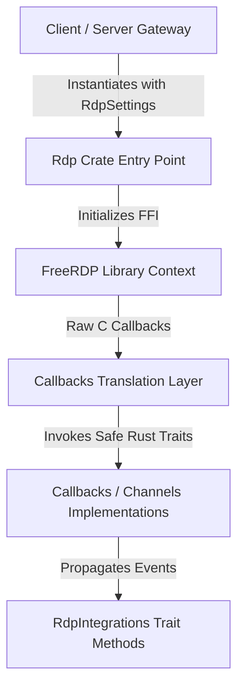

# Reference Guide: Unified RDP Wrapper Crate

This document describes the design, architecture, and programming interface of the unified `rdp` crate. This crate is designed to serve as a 100% identical codebase in both client and gateway implementations so it can eventually be extracted into a standalone library.

---

## 1. Core Architecture

The crate acts as a safe Rust wrapper around `FreeRDP` via raw FFI bindings in `freerdp-sys`. It manages the connection lifecycle, events, and channel callbacks:



---

## 2. Configuration System

### `RdpSettings`

Contains all target parameters, rendering instructions, and redirection configurations.

```rust
pub struct RdpSettings {
    pub server: String,
    pub port: u32,
    pub user: String,
    pub password: String,
    pub domain: String,
    pub screen_size: ScreenSize,
    pub best_experience: bool,
    pub redirections: RdpRedirections,
    pub rail: Option<RailSettings>,
    pub features: RdpFeatures,
    pub options: RdpOptions,
}

pub struct RdpFeatures {
    pub disable_threading: bool,
    pub force_software_gdi: bool,
}

pub struct RdpOptions {
    pub use_nla: bool,
    pub verify_cert: bool,
    pub use_local_scaler: bool,
    pub use_tunnel: bool,
    pub desktop_scale: f64,
}
```

### `RdpRedirections`

Redirection features grouped logically under a nested block:

```rust
pub struct RdpRedirections {
    pub clipboard: bool,
    pub audio: bool,
    pub mic: bool,
    pub printing: bool,
    pub smartcard: bool,
    pub drives: Vec<String>,
    pub webcam: Option<WebcamSettings>,
    pub sound_latency_threshold: Option<u16>,
}
```

### `RailSettings` & `RailBehavior`

Enables RemoteApp mode and sets the rendering behavior strategy.

```rust
pub struct RailSettings {
    pub app: String,
    pub args: Option<String>,
    pub working_dir: Option<String>,
    pub title: Option<String>,
    pub server_info: Option<ServerInfo>,
    pub behavior: RailBehavior,
}

pub enum RailBehavior {
    /// Mode A: Composites window updates onto a single desktop primary GDI canvas.
    /// Emits general `UpdateRects` messages. Minimal metadata parsed for windows.
    CompositeGdi,

    /// Mode B: Intercepts graphics surfaces individually.
    /// Emits `WindowPixels` and rich metadata (owners, parents, styles, icons).
    IndividualWindows,
}
```

---

## 3. Integration System (Traits)

To run in both desktop clients (`uds-client` using JS/Egui/Qt) and HTML5 servers (`rdphtml5` using WebSockets/WebCodecs), the crate decouples I/O side-effects through type-safe traits passed inside the `RdpIntegrations` container.

```rust
pub struct RdpIntegrations {
    pub clipboard: Option<Box<dyn ClipboardIntegration>>,
    pub audio_output: Option<Box<dyn AudioOutputIntegration>>,
    pub audio_input: Option<Box<dyn AudioInputIntegration>>,
    pub webcam: Option<Box<dyn WebcamIntegration>>,
    pub smartcard: Option<Arc<dyn SmartcardIntegration>>,
}
```

### `ClipboardIntegration`

Handles bidirectional text and format synchronization.

```rust
pub trait ClipboardIntegration: Send + Sync + std::fmt::Debug {
    fn on_format_advertised(&self, format: u32);
    fn on_data_received(&self, format: u32, data: &[u8]);
    fn register_callback(&self, callback: Box<dyn ClipboardCallback>);
}
```

### `AudioOutputIntegration`

Outputs audio packets received from the server.

```rust
pub trait AudioOutputIntegration: Send + Sync + std::fmt::Debug {
    fn play_samples(&self, format: u16, channels: u16, rate: u32, data: &[u8]);
}
```

### `AudioInputIntegration`

Supplies microphone capture samples to be transmitted to the RDP server.

```rust
pub trait AudioInputIntegration: Send + Sync + std::fmt::Debug {
    fn capture_samples(&self) -> Option<Vec<i16>>;
    fn set_format(&self, sample_rate: u32, channels: u32);
}
```

### `WebcamIntegration`

Supplies captured webcam frames for the MS-RDPECAM channel.

```rust
pub trait WebcamIntegration: Send + Sync + std::fmt::Debug {
    fn is_h264_available(&self) -> bool;
    fn get_camera_dimensions(&self) -> (u32, u32);
    fn get_max_dimensions(&self) -> (u32, u32);
    fn get_fps(&self) -> u32;
    fn set_mode(&self, mode: WebcamMode);
    fn set_format(&self, format: u32, width: u32, height: u32, fps: u32);
    fn start_stream(&self, width: u32, height: u32, fps: u32) -> flume::Receiver<WebcamFrame>;
    fn stop_stream(&self);
    fn request_sample(&self, channel_ptr: usize);
    fn push_frame(&self, data: Vec<u8>);
    fn set_limits(&self, _quality: u32, _fps: u32, _max_width: u32, _max_height: u32) {}
    fn get_device_name(&self) -> String {
        "UDS Camera".to_string()
    }
}
```

### `SmartcardIntegration`

Provides smartcard redirection capabilities via the [MS-RDPESC] protocol. Unlike other channels which are Dynamic Virtual Channels (DVCs), smartcard uses a **Static Virtual Channel (SVC)** registered through **RDP Device Redirection (RDPDR)** via `custom_addin_provider`. The addin layer (`addins/smartcard.rs`) receives IRPs from the RDPDR channel, decodes them via FreeRDP's `smartcard_irp_device_control_decode`, and dispatches them to the trait.

The trait is backend-agnostic — implementations can back it with dummy responses, pcsc-lite, or a WebSocket bridge.

```rust
pub trait SmartcardIntegration: Send + Sync + std::fmt::Debug {
    // === Context Management ===
    fn establish_context(&self, scope: u32) -> Result<ScardContext, u32>;
    fn release_context(&self, ctx: &ScardContext) -> Result<(), u32>;
    fn is_valid_context(&self, ctx: &ScardContext) -> bool;

    // === Reader Discovery ===
    fn list_readers(&self, ctx: &ScardContext, groups: Option<&[String]>)
        -> Result<Vec<String>, u32>;

    // === Card Connection ===
    fn connect(&self, ctx: &ScardContext, reader: &str, share_mode: u32,
               preferred_protocols: u32) -> Result<ConnectResult, u32>;
    fn disconnect(&self, handle: &ScardHandle, disposition: u32) -> Result<(), u32>;
    fn reconnect(&self, handle: &ScardHandle, share_mode: u32,
                 preferred_protocols: u32, initialization: u32) -> Result<u32, u32>;

    // === Card Communication ===
    fn transmit(&self, handle: &ScardHandle, send_pci: &ScardIORequest,
                data: &[u8]) -> Result<TransmitResult, u32>;
    fn control(&self, handle: &ScardHandle, control_code: u32,
               in_data: &[u8]) -> Result<Vec<u8>, u32>;

    // === Status & State ===
    fn status(&self, handle: &ScardHandle) -> Result<ScardStatus, u32>;
    fn get_status_change(&self, ctx: &ScardContext, timeout: Duration,
                         reader_states: &[ReaderStateIn])
        -> Result<Vec<ReaderStateOut>, u32>;

    // === Transactions ===
    fn begin_transaction(&self, handle: &ScardHandle) -> Result<(), u32>;
    fn end_transaction(&self, handle: &ScardHandle, disposition: u32) -> Result<(), u32>;

    // === Attributes ===
    fn get_attrib(&self, handle: &ScardHandle, attr_id: u32) -> Result<Vec<u8>, u32>;
    fn set_attrib(&self, handle: &ScardHandle, attr_id: u32, data: &[u8]) -> Result<(), u32>;

    // === ATR Matching ===
    fn locate_cards_by_atr(&self, ctx: &ScardContext, atrs: &[(Vec<u8>, Vec<u8>)],
                           reader_states: &[ReaderStateIn])
        -> Result<Vec<LocateCardResult>, u32>;

    // === Cancel ===
    fn cancel(&self, ctx: &ScardContext) -> Result<(), u32>;

    // === Meta ===
    fn is_available(&self) -> bool;
}
```

#### Auxiliary Types

```rust
pub struct ScardContext(u64);      // Opaque SCARDCONTEXT handle
pub struct ScardHandle { ... }     // Opaque SCARDHANDLE + active_protocol
pub struct ScardIORequest { ... }  // Protocol ID + extra bytes
pub struct TransmitResult { ... }  // recv_pci + recv_buffer
pub struct ScardStatus { ... }     // reader_names, state, protocol, atr
pub struct ReaderStateIn { ... }   // reader_name + current_state
pub struct ReaderStateOut { ... }  // reader_name + event_state + atr
pub struct LocateCardResult { ... }// reader_name + atr_match + event_state
pub struct ConnectResult { ... }   // handle + active_protocol
```

---

## 4. Callbacks & Event Loop Translation

The crate exposes traits representing various callback groups defined by FreeRDP:

- `UpdateCallbacks`: General rendering updates (primary draw, GDI painting, palette setups).
- `PointerCallbacks`: Cursor movement and cursor image/icon changes.
- `WindowCallbacks`: Window lifecycle events (create, update, delete, active state changes).
- `InstanceCallbacks`: General instance authentication and verification.

Each callback group is bound at connection initialization time, bridging low-level FFI C-style pointers into these safe, high-level Rust traits.
